#TP1 Vision par ordinateur

##Installation et prise en main
Sur mac osx, installer brew:

````sh
/usr/bin/ruby -e "$(curl -fsSL https://raw.githubusercontent.com/Homebrew/install/master/install)"
````

Puis installer python 2.7 et opencv:

````sh
brew install python 
brew tap homebrew/science
brew install opencv
````

###Premier test
Nous naviguons dans le dossier voulu, et creons le dossier, `mkdir Visord` puis créons le premier sketch. `vim firstSketch.py`

Son code est le suivant:

```python
import numpy as np
from matplotlib import pyplot as plt 
import cv2


def loadImage(src): 
	img=cv2.imread(src ,1) 
	cv2.imshow('image',img) 
	cv2.waitKey(0)
	cv2.destroyAllWindows()
	
if __name__ =='__main__': 
	loadImage ('lena.jpg')

```
[firstSketch.py]

##Detection de peau
Avant de commencer, il est à noter que les approches colorimétriques souffrent d'une dépendance aux conditions d'illuminations, ce qui les rends nettement moins robustes que d'autres approches. Dans le cas de léna par exemple, le sepia des elements de fonds se confondent avec sa peau. De fait n'importe quelle approche pixel par pixel souffrira du fait qu'elle ne prend pas en compte le contexte de ce pixel.

Il est donc important de se poser la question de l'elaboration d'une modelisation robuste, et donc de l'espace colorimetrique dans lequel on travaille qui peut grandement influencer sur cette robustesse

###Une première methode simple

Le code avec la methode "naive" ressemble à ceci

````python
import numpy as np
from matplotlib import pyplot as plt 
import cv2
import sys
img=0

def loadImage(src): 
	global img
	img=cv2.imread(src ,1) 
	cv2.imshow('image',img) 

def classifyPixel(x,y):
	R=img[x,y][2]
	B=img[x,y][0]
	G=img[x,y][1]
	if(R>95 and G>40 and B>20 and (max(R,G,B)-min(R,G,B))>15 and abs(R-G)>15 and R>G and R>B):
		return [255,255,255]
	else:
		return [0,0,0] 


if __name__ =='__main__':
	loadImage ('lena.jpg')
	imgHeight=img.shape[0]
	imgWidth=img.shape[1]
	print "The image width is %d." % imgWidth
	print "The image height is %d." % imgHeight
	print "it has %d channels" % img.shape[2]
	if(img.shape[2]<3):
					print "not enough channel to work on, try RGB images"
					sys.exit()
	blank_image =np.zeros((imgHeight, imgWidth, 3), np.uint8) 
	for x in range(0, imgHeight):
			for y in range(0,imgWidth):
					blank_image[x,y]=classifyPixel(x,y)
	cv2.imwrite('output.jpg',blank_image)
	sys.exit()


````
[secondSketch.py]

Les resultats sont mitigés:
####image originale:
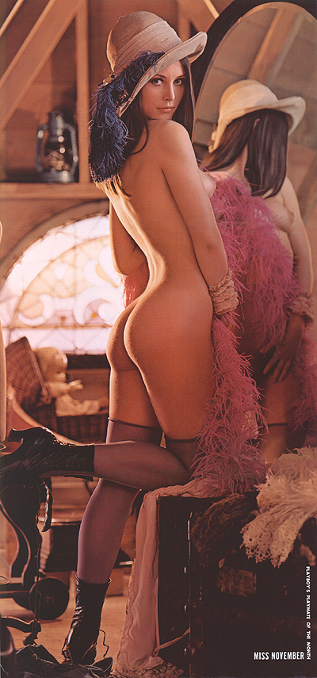

####image traitée:
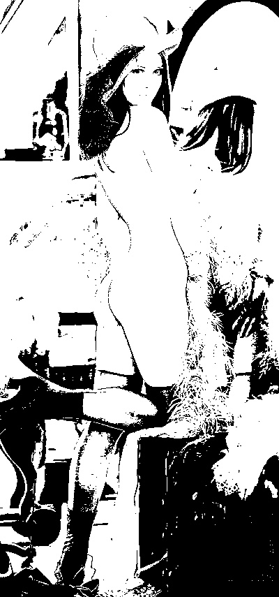

Ainsi la plus grande partie de l'image est reconnue comme de la peau.


###Approche non-parametrique
On tente une nouvelle approche se basant sur la construction d'histogramme 2D. 
L'implementation de la fonction se fait comme suit:

````python
import numpy as np
import csv
from matplotlib import pyplot as plt 
import cv2
import sys
img=0

def loadImage(src): 
	global img
	img=cv2.imread(src ,1) 
	cv2.imshow('image',img) 

if __name__ =='__main__':
	loadImage ('lena.jpg')
	imgHeight=img.shape[0]
	imgWidth=img.shape[1]
	print "The image width is %d." % imgWidth
	print "The image height is %d." % imgHeight
	print "it has %d channels" % img.shape[2]
	if(img.shape[2]<3):
					print "not enough channel to work on, try RGB images"
					sys.exit()

	hist_full = cv2.calcHist([img],[1,2],None,[32,32],[0,32,0,32])
	with open('test.csv', 'w') as fp:
		a = csv.writer(fp, delimiter=',')
		data = hist_full
		a.writerows(data)
	sys.exit()

````

Ce programme sort un histogramme 2D rouge et vert. Pour avoir des resultats plus probant, il faut modifier l'espace de couleur. 

Pour cela on utilise la fonction cvtColor comme suit:`imgLab = cv2.cvtColor(image, cv2.COLOR_BGR2LAB)` et `imgHSV = cv2.cvtColor(image, cv2.COLOR_BGR2HSV)` pour avoir respectivement l'espace LAB et HSV


####Construction d'histogrammes
On utilise les données de la base pour créer des histogramme pour une image, dans chaque espace de couleur. On utilise le masque proposé pour créer un histogramme des pixels peau et non-peau.

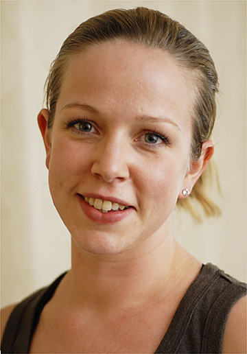
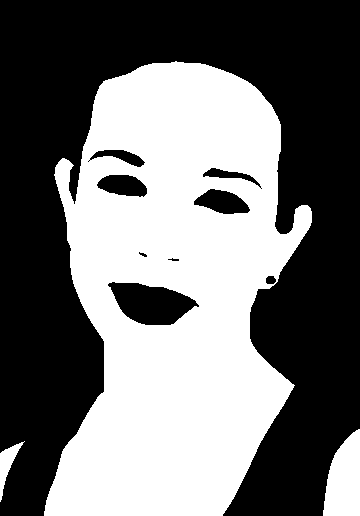

Le code permet de generer automatiquement les histogramme:

````python
import numpy as np
import csv
from matplotlib import pyplot as plt 
import cv2
from mpl_toolkits.mplot3d import Axes3D
import sys
img=0
mask=0

def loadImage(src): 
    global img
    img=cv2.imread('BaseImageUCD/Pratheepan_Dataset/FacePhoto/'+src ,1) 
    img.astype(np.uint8)
    cv2.imshow('image',img) 


def loadMask(src): 
    global mask                                                                                                                                                                 
    mask=cv2.imread('BaseImageUCD/Ground_Truth/GroundT_FacePhoto/'+src ,1)
    mask.astype(np.uint8)
    mask=cv2.cvtColor(mask, cv2.COLOR_BGR2GRAY)
    cv2.imshow('image',mask)

def classifyPixel(x,y):
    R=img[x,y][2]
    B=img[x,y][0]
    G=img[x,y][1]
    if(R>95 and G>40 and B>20 and (max(R,G,B)-min(R,G,B))>15 and abs(R-G)>15 and R>G and R>B):
        return [255,255,255]
    else:
        return [0,0,0] 


if __name__ =='__main__':
    loadImage ('06Apr03Face.jpg')
    loadMask('06Apr03Face.png')
    imgHeight=img.shape[0]
    imgWidth=img.shape[1]
    print "The image width is %d." % imgWidth
    print "The image height is %d." % imgHeight
    print "it has %d channels" % img.shape[2]
    if(img.shape[2]<3):
                    print "not enough channel to work on, try RGB images"
                    sys.exit()
    """
    here the faces
    """

    hist_fullLABF = cv2.calcHist([cv2.cvtColor(img, cv2.COLOR_BGR2LAB)],[1,2],mask,[32,32],[0,256,0,256])*100000/(imgWidth*imgHeight)
    hist_fullRGBF = cv2.calcHist([img],[1,2],mask,[32,32],[0,256,0,256])*100000/(imgWidth*imgHeight)
    hist_fullHSVF = cv2.calcHist([cv2.cvtColor(img, cv2.COLOR_BGR2HSV)],[0,1],mask,[32,32],[0,256,0,256])*100000/(imgWidth*imgHeight)
    """
    here the rest
    """

    hist_fullLABR = cv2.calcHist([cv2.cvtColor(img, cv2.COLOR_BGR2LAB)],[1,2],255-mask,[32,32],[0,256,0,256])*100000/(imgWidth*imgHeight)
    hist_fullRGBR = cv2.calcHist([img],[1,2],255-mask,[32,32],[0,256,0,256])*100000/(imgWidth*imgHeight)
    hist_fullHSVR = cv2.calcHist([cv2.cvtColor(img, cv2.COLOR_BGR2HSV)],[0,1],255-mask,[32,32],[0,256,0,256])*100000/(imgWidth*imgHeight)
    fig = plt.figure()
    ax = fig.add_subplot(111, projection='3d')
    for x in range (0,32):
        for y in range (0,32):
            xs = x
            ys = y
            zs = hist_fullHSVR[x][y]
            ax.scatter(xs, ys, zs)
    plt.show()
    
    
    
    
    with open('Hist/RGBFaces.csv', 'w') as fp:
        a = csv.writer(fp, delimiter=',')
        data = hist_fullRGBF
        a.writerows(data)
    with open('Hist/HSVFaces.csv', 'w') as fp:
        a = csv.writer(fp, delimiter=',')                                                                                                                                        
        data = hist_fullHSVF
        a.writerows(data)
    with open('Hist/LABFaces.csv', 'w') as fp:
        a = csv.writer(fp, delimiter=',')                                                                                                                                        
        data = hist_fullLABF
        a.writerows(data)
    with open('Hist/RGBRest.csv', 'w') as fp:
        a = csv.writer(fp, delimiter=',')
        data = hist_fullRGBR
        a.writerows(data)
    with open('Hist/HSVRest.csv', 'w') as fp:
        a = csv.writer(fp, delimiter=',')                                                                                                                                        
        data = hist_fullHSVR
        a.writerows(data)
    with open('Hist/LABRest.csv', 'w') as fp:
        a = csv.writer(fp, delimiter=',')                                                                                                                                        
        data = hist_fullLABR
        a.writerows(data)
        plt.show()
````
[thirdsketch.py]

Ces histogrammes vont ensuite nous permettre de faire une analyse statistique de l'appartenance ou pas d'un pixel à la peau. 


On implementa un traitement automatique de toute la base pour avoir des données statistiquement signifiantes:

````python
import numpy as np
import csv
from matplotlib import pyplot as plt 
import cv2
import os
from os import listdir
from os.path import isfile, join
from mpl_toolkits.mplot3d import Axes3D
import sys
img=0
mask=0
hist_fullLABF =0
hist_fullRGBF =0
hist_fullHSVF =0
hist_fullLABR =0
hist_fullRGBR =0
hist_fullHSVR =0
mypath='./BaseImageUCD/Pratheepan_Dataset/FacePhoto/'
path_imagetotest=''

def loadImage(src): 
    global img
    print 'BaseImageUCD/Pratheepan_Dataset/FacePhoto/'+src
    img=cv2.imread('BaseImageUCD/Pratheepan_Dataset/FacePhoto/'+src ,1) 
    img.astype(np.uint8)
    cv2.imshow('image',img) 


def loadMask(src): 
    global mask                                                                                                                                                                 
    mask=cv2.imread('BaseImageUCD/Ground_Truth/GroundT_FacePhoto/'+src ,1)
    mask.astype(np.uint8)
    mask=cv2.cvtColor(mask, cv2.COLOR_BGR2GRAY)
    cv2.imshow('image',mask)

def classifyPixel(x,y):
    R=img[x,y][2]
    B=img[x,y][0]
    G=img[x,y][1]
    if(R>95 and G>40 and B>20 and (max(R,G,B)-min(R,G,B))>15 and abs(R-G)>15 and R>G and R>B):
        return [255,255,255]
    else:
        return [0,0,0] 

def analyzeImage(imgName):
    global hist_fullLABF
    global hist_fullHSVF
    global hist_fullRGBF
    global hist_fullLABR 
    global hist_fullRGBR 
    global hist_fullHSVR 
    print imgName    
    loadImage (imgName+'.jpg')
    loadMask(imgName+'.png')
    imgHeight=img.shape[0]
    imgWidth=img.shape[1]
    print "The image width is %d." % imgWidth
    print "The image height is %d." % imgHeight
    print "it has %d channels" % img.shape[2]
    if(img.shape[2]<3):
                    print "not enough channel to work on, try RGB images"
                    sys.exit()

    hist_fullLABF += cv2.calcHist([cv2.cvtColor(img, cv2.COLOR_BGR2LAB)],[1,2],mask,[32,32],[0,256,0,256])*100000/(imgWidth*imgHeight)
    hist_fullRGBF += cv2.calcHist([img],[1,2],mask,[32,32],[0,256,0,256])*100000/(imgWidth*imgHeight)
    hist_fullHSVF += cv2.calcHist([cv2.cvtColor(img, cv2.COLOR_BGR2HSV)],[0,1],mask,[32,32],[0,256,0,256])*100000/(imgWidth*imgHeight)

    hist_fullLABR += cv2.calcHist([cv2.cvtColor(img, cv2.COLOR_BGR2LAB)],[1,2],255-mask,[32,32],[0,256,0,256])*100000/(imgWidth*imgHeight)
    hist_fullRGBR += cv2.calcHist([img],[1,2],255-mask,[32,32],[0,256,0,256])*100000/(imgWidth*imgHeight)
    hist_fullHSVR += cv2.calcHist([cv2.cvtColor(img, cv2.COLOR_BGR2HSV)],[0,1],255-mask,[32,32],[0,256,0,256])*100000/(imgWidth*imgHeight)
    

 

if __name__ =='__main__':
    onlyfiles = [f for f in listdir(mypath) if isfile(join(mypath, f))]
    count=0
    for imagefile in onlyfiles :
        print os.path.splitext(imagefile)[1]
        if(os.path.splitext(imagefile)[1]== '.jpg' or os.path.splitext(imagefile)[0]== '.png'):
            analyzeImage(os.path.splitext(imagefile)[0])
            count+=1
    
    with open('TotalHist/RGBFaces.csv', 'w') as fp:
        a = csv.writer(fp, delimiter=',')
        data = hist_fullRGBF/count
        a.writerows(data)
    with open('TotalHist/HSVFaces.csv', 'w') as fp:
        a = csv.writer(fp, delimiter=',')                                                                                                                                        
        data = hist_fullHSVF/count
        a.writerows(data)
    with open('TotalHist/LABFaces.csv', 'w') as fp:
        a = csv.writer(fp, delimiter=',')                                                                                                                                        
        data = hist_fullLABF/count
        a.writerows(data)
    with open('TotalHist/RGBRest.csv', 'w') as fp:
        a = csv.writer(fp, delimiter=',')
        data = hist_fullRGBR/count
        a.writerows(data)
    with open('TotalHist/HSVRest.csv', 'w') as fp:
        a = csv.writer(fp, delimiter=',')                                                                                                                                        
        data = hist_fullHSVR/count
        a.writerows(data)
    with open('TotalHist/LABRest.csv', 'w') as fp:
        a = csv.writer(fp, delimiter=',')                                                                                                                                        
        data = hist_fullLABR/count
        a.writerows(data)
   
````
[fourthSketch.py]


Par exemple pour l'espace LAB:

#####Peau
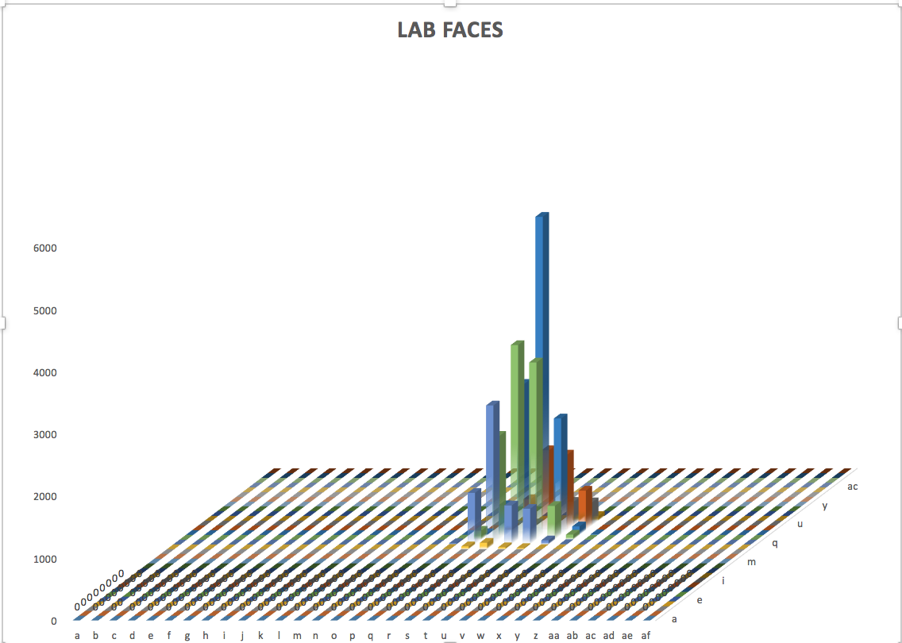

#####Non-Peau
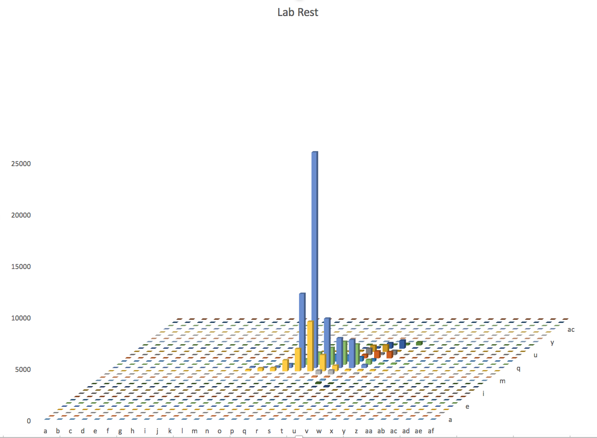


L'ensemble des .csv généré pour l'ensemble de la base de données  est disponible dans le fichier TotalHist.


####Detection de la peau à partir des histogrammes

A partir de ces histogrammes, on utilise la methode de Bayes pour decider si un pixel correspond à de la peau ou pas. On utilise la formule suivante:

p(peau|c) = p(c|peau)p(peau) / (p(c|peau)p(peau) + p(c|¬peau)p(¬peau))

Dans la pratique on fait un programme permettant de detecter la peau sur une photo à partir des information tirées du reste de la base:

````python

from __future__ import division
import numpy as np
import csv
from matplotlib import pyplot as plt 
import cv2
import os
from os import listdir
from os.path import isfile, join
from mpl_toolkits.mplot3d import Axes3D
import sys
img=0
mask=0
hist_fullLABF =0
hist_fullRGBF =0
hist_fullHSVF =0
hist_fullLABR =0
hist_fullRGBR =0
hist_fullHSVR =0
mypath='./BaseImageUCD/Pratheepan_Dataset/FacePhoto/' 
toTest='evangeline-lilly-face-wallpapers_1593_1024'
ppeau=0
totalp=0
percentPeau=0
TP=0
FP=0

def loadImage(src): 
    global img
    print 'BaseImageUCD/Pratheepan_Dataset/FacePhoto/'+src
    img=cv2.imread('BaseImageUCD/Pratheepan_Dataset/FacePhoto/'+src ,1) 
    img.astype(np.uint8)
    cv2.imshow('image',img) 


def loadMask(src): 
    global mask     
    global ppeau
    global totalp
    mask=cv2.imread('BaseImageUCD/Ground_Truth/GroundT_FacePhoto/'+src ,1)
    mask.astype(np.uint8)
    mask=cv2.cvtColor(mask, cv2.COLOR_BGR2GRAY)
    ppeau+=cv2.countNonZero(mask)
    totalp+=mask.shape[0]*mask.shape[1]
    cv2.imshow('image',mask)

def classifyPixel(x,y):
    R=img[x,y][2]
    B=img[x,y][0]
    G=img[x,y][1]
    if(R>95 and G>40 and B>20 and (max(R,G,B)-min(R,G,B))>15 and abs(R-G)>15 and R>G and R>B):
        return [255,255,255]
    else:
        return [0,0,0] 

def analyzeImage(imgName):
    global hist_fullLABF
    global hist_fullHSVF
    global hist_fullRGBF
    global hist_fullLABR 
    global hist_fullRGBR 
    global hist_fullHSVR 
    print imgName    
    loadImage (imgName+'.jpg')
    loadMask(imgName+'.png')
    imgHeight=img.shape[0]
    imgWidth=img.shape[1]
    print "The image width is %d." % imgWidth
    print "The image height is %d." % imgHeight
    print "it has %d channels" % img.shape[2]
    if(img.shape[2]<3):
                    print "not enough channel to work on, try RGB images"
                    sys.exit()

    hist_fullLABF += cv2.calcHist([cv2.cvtColor(img, cv2.COLOR_BGR2LAB)],[1,2],mask,[32,32],[0,256,0,256])*100000/(imgWidth*imgHeight)
    hist_fullRGBF += cv2.calcHist([img],[1,2],mask,[32,32],[0,256,0,256])*100000/(imgWidth*imgHeight)
    hist_fullHSVF += cv2.calcHist([cv2.cvtColor(img, cv2.COLOR_BGR2HSV)],[0,1],mask,[32,32],[0,256,0,256])*100000/(imgWidth*imgHeight)

    hist_fullLABR += cv2.calcHist([cv2.cvtColor(img, cv2.COLOR_BGR2LAB)],[1,2],255-mask,[32,32],[0,256,0,256])*100000/(imgWidth*imgHeight)
    hist_fullRGBR += cv2.calcHist([img],[1,2],255-mask,[32,32],[0,256,0,256])*100000/(imgWidth*imgHeight)
    hist_fullHSVR += cv2.calcHist([cv2.cvtColor(img, cv2.COLOR_BGR2HSV)],[0,1],255-mask,[32,32],[0,256,0,256])*100000/(imgWidth*imgHeight)

def translate(value, leftMin, leftMax, rightMin, rightMax):
        # Figure out how 'wide' each range is
    leftSpan = leftMax - leftMin
    rightSpan = rightMax - rightMin

    # Convert the left range into a 0-1 range (float)
    valueScaled = float(value - leftMin) / float(leftSpan)

    # Convert the 0-1 range into a value in the right range.
    return rightMin + (valueScaled * rightSpan)

def classify(imgName):
    global img
    global FP
    global TP
    loadImage(imgName+'.jpg')
    loadMask(imgName+'.png')
    img=cv2.blur(img,(10,10))
    imgHeight=img.shape[0]
    imgWidth=img.shape[1]
    blank_image =np.zeros((imgHeight, imgWidth, 1), np.uint8)
    for x in range(0, imgHeight):
        for y in range(0,imgWidth):
            R=img[x,y][2]
            R=translate(R,0,255,0,31)
            B=img[x,y][0]
            B=translate(B,0,255,0,31)
            G=img[x,y][1]
            G=translate(G,0,255,0,31)
            histopeau=hist_fullRGBF[G,R]
            histononpeau=hist_fullRGBR[G,R]
            print (histopeau*percentPeau)/(histopeau*percentPeau+histononpeau*(100-percentPeau))
            if((histopeau*percentPeau)/(histopeau*percentPeau+histononpeau*(100-percentPeau))>0.003):
                blank_image[x,y]=255
                if(mask[x,y]!=0):
                    TP+=1
                else:
                    FP+=1
            else:
                blank_image[x,y]=0
    cv2.imwrite('output2.jpg',blank_image)
    print TP
    print FP
    print TP/FP
    sys.exit()
    

if __name__ =='__main__':
    global percentPeau
    onlyfiles = [f for f in listdir(mypath) if isfile(join(mypath, f))]
    count=0
    for imagefile in onlyfiles :
        print os.path.splitext(imagefile)[1]
        if(os.path.splitext(imagefile)[1]== '.jpg' or os.path.splitext(imagefile)[0]== '.png'):
            if(os.path.splitext(imagefile)[0]!=toTest):
                analyzeImage(os.path.splitext(imagefile)[0])
                count+=1
    print ppeau
    print totalp
    percentPeau=ppeau/totalp
    print percentPeau
    classify(toTest);
````
[rgbSketch.py]

On implement ce programme aussi pour le domaine HSV, à voir dans hsvSketch.py

####Evaluation


Le seuil est determiné de manière empirique et peut donner de bons résultats en fonction du seuil:

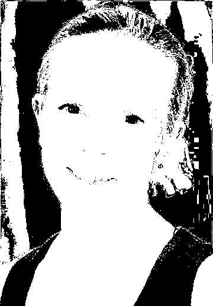

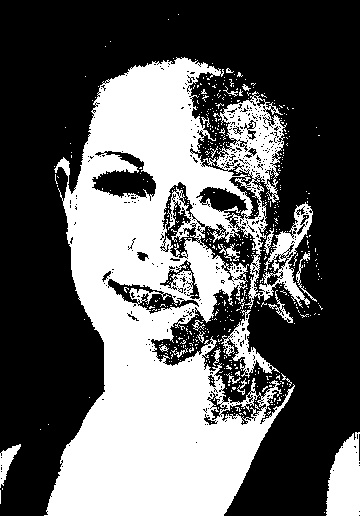

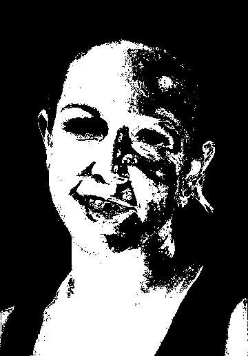

Et dans un exemple en LAB:

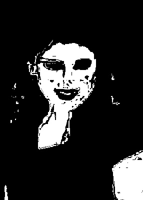

et 


On voit que le resultat est grandement dépendant de l'image. Dès que le background n'est pas très marqué, le detecteur est bien moins fiable. 


Pour faciliter l'evalution, le programme renvoie une valeur indiquant le nombre de faux positifs et de faux négatifs et le ratio des deux.

On le voit, la qualité de la detection depends des conditions d'eclairements globale de l'image. A savoir, si les conditions d'eclairements correspondent ou pas à a moyenne de celles de la base.

Par exemple pour les photos "neutres, on peut arriver à d'excellent résultats avec seulement 10460 pixels faux positifs, contre 52399 vrais (espace HSV)

 
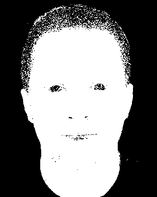

####Amelioration

Je propose deux points d'amelioration

* Appliquer un floux gaussien avant traitement limite un certain nombre d'erreurs
* Un niveau dynamique de detection devrait etre mis en place en essayant le seuil sur des photos connues et en tentant de touver le niveaux de sueuillage diminuant au plus le nombre d'erreurs.


##Detection de visages par l’approche de Viola Jones
